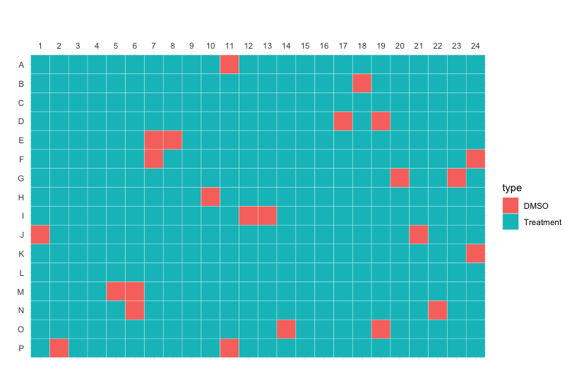

# JUMP-MOA
`JUMP-MOA` is list of compounds with diverse MOAs that fit on a single 384-well plate, with 4 replicates per compound. 
There are 90 compounds from 47 distinct MOA classes. The recommended concentration for these compounds is `3 uM`. 
This resource was created through the [JUMP-Cell Painting Consortium](https://jump-cellpainting.broadinstitute.org/).

## Files

[`JUMP-MOA_compound_metadata.tsv`](JUMP-MOA_compound_metadata.tsv)

| Column | Description |
| :----- | :---------- |
| broad_sample | Compound ID in Broad Institute's compound management database |
| InChIKey | [International Chemical Identifier](https://en.wikipedia.org/wiki/International_Chemical_Identifier) |
| pert_iname | Compound name |
| pubchem_cid	 | PubChem ID e.g. [`72716071`](https://pubchem.ncbi.nlm.nih.gov/compound/72716071) |
| moa | Mechanism-of-action annotation, derived from [Broad Drug Repurposing Hub](https://clue.io/repurposing) and curated [here](https://github.com/broadinstitute/lincs-cell-painting/blob/master/metadata/moa/repurposing_info_external_moa_map_resolved.tsv) |
| smiles | Simplified molecular-input line-entry system ([SMILES](https://en.wikipedia.org/wiki/Simplified_molecular-input_line-entry_system)) string |

[`JUMP-MOA_compound_platemap.tsv`](JUMP-MOA_compound_metadata.tsv)

| Column | Description |
| :----- | :---------- |
| well_position | Well position |
| broad_sample | Compound ID in Broad Institute's compound management database |
| solvent | Solvent (always DMSO) |

## Plate layout

